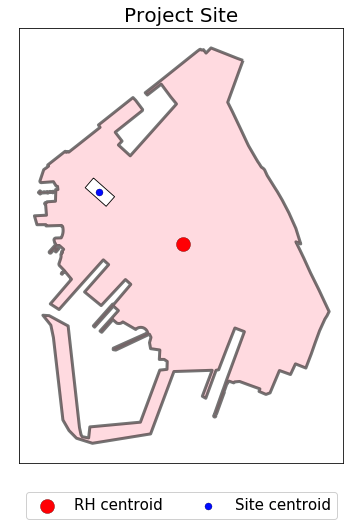

# Chapter 21 - Neighborhood Character

### [CEQR technical manual chapter 21](https://www1.nyc.gov/assets/oec/technical-manual/21_Neighborhood_Character_2014.pdf)

->  <-

Figure: Red Hook with project site.

The CEQR technical manual recommends that applicants incorporate the results from 8 other sections of the manual into their assessment of a project's predicted impact on neighborhood character. We followed the manual's guidance in this respect, however, we also felt it was necessary to perform additional analyses in order to truly understand neighborhood character. We therefore collected and analyzed data relating to business activity, local political issues, and other factors relevant to the daily lives of neighborhood residents.

Our supplemental analyses confirmed many of our intuitive, experience-based notions about the neighborhood - that Red Hook is a thriving, diverse community with a vibrant arts scene and active entrepreneurs. Our proposed project, which will add housing for residents of varying income levels as well as manufacturing and office space, is therefore well-suited to the character of the neighborhood now and into the future.

We would have liked, however, to conduct further analysis on alternative media related to Red Hook, such as Instagram and Twitter posts and other social media outlets. Obtaining data from these outlets proved to be a technical challenge that we were unable to overcome in a relatively short period of time. We did succeed, though, in acquiring user review data from Yelp for the neighborhood, which could provide useful insights into the "feel" of the neighborhood in a follow-up analysis. 

While additional research would add even more depth to our analysis (by successfully collecting and analyzing data from Instagram and Twitter, for example), we believe that, overall, we have created an informative and factual assessment of neighborhood character in Red Hook. If you have any additional suggestions or comments, please get in touch with us at alexandros@drawbrooklyn.com.